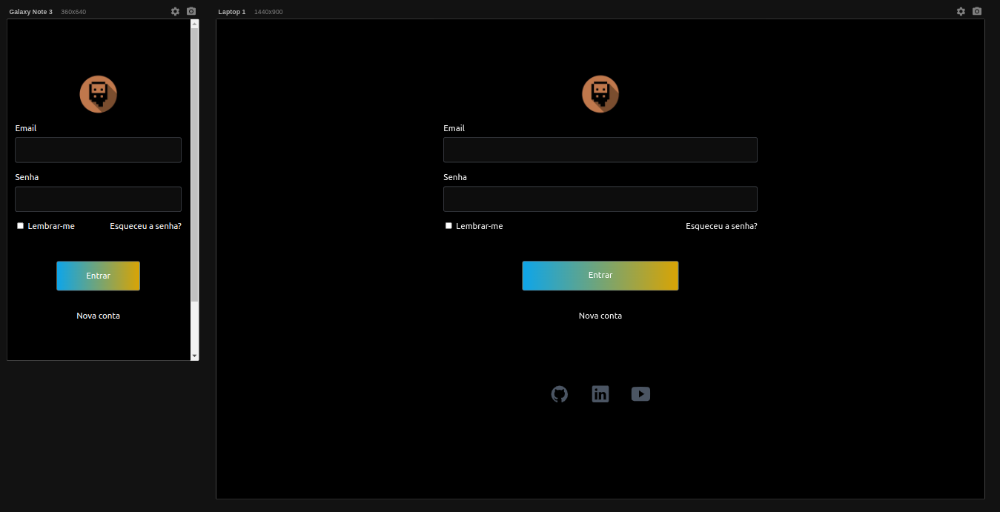
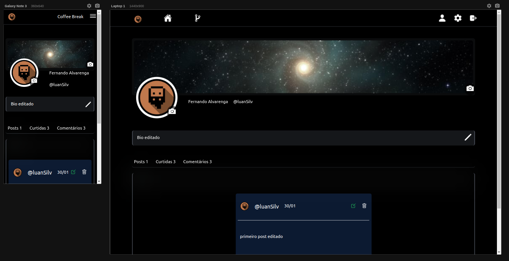

# Coffee Break -- social network

<div style="display:flex; gap:10px">


</div>

<br>
  
> **Coffee Break** é um projeto Front-end no contexto de uma pequena rede social

## Sobre

Este projeto consome a minha [API](https://fast-flask-api.herokuapp.com/docs)
que faz *integração* com banco de dados (postgre) em nuvem  e você pode ver [Projeto](https://github.com/Fernando-Medeiros/Fast-Flask-API) <- aqui .


O projeto inclui algumas caracteristicas interessantes utilizando **Jinja**, por exemplo:

- [Modelos de Páginas](../app/frontend/templates/pages/)
- [Modelos de Formulários](../app/frontend/templates/forms/)
- [Modelos de Schemas](../app/frontend/templates/schemas/)


## Resumo
- [Coffee Break -- social network](#coffee-break----social-network)
  - [Sobre](#sobre)
  - [Resumo](#resumo)
  - [Requisitos](#requisitos)
  - [Ambiente](#ambiente)
  - [Iniciar o servidor](#iniciar-o-servidor)
  - [Estrutura](#estrutura)


## Requisitos

- Git
- Python 3.10
- virtualenv ou semelhante
- Conexão com a API do [PROJETO -> FFA](https://github.com/Fernando-Medeiros/Fast-Flask-API) 

## Ambiente

Crie o ambiente virtual

```console
virtualenv .venv
```

Ative o ambiente 

```console
# Linux Bash
source .venv/bin/activate
```

Instale as dependências de desenvolvimento e teste

```console
pip install -r requirements-dev.txt
```

## Iniciar o servidor

Inicie o localhost

```console
# debug
flask run

# produção
gunicorn 'app:create_app()'
```

## Estrutura

```console
.
├── app
│   ├── backend
│   │   ├── api
│   │   │   ├── auth.py
│   │   │   ├── client.py
│   │   │   └── posts.py
│   │   ├── forms
│   │   │   ├── auth.py
│   │   │   └── post.py
│   │   ├── models
│   │   │   └── client.py
│   │   ├── routers.py
│   │   └── routes
│   │       ├── auth.py
│   │       ├── home.py
│   │       ├── profile.py
│   │       └── project.py
│   ├── frontend
│   │   ├── static
│   │   │   ├── img
│   │   │   │   ├── background.jpg
│   │   │   │   ├── default.png
│   │   │   │   └── logo.png
│   │   │   └── js
│   │   │       └── brand.js
│   │   └── templates
│   │       ├── alert.html
│   │       ├── base.html
│   │       ├── brand.html
│   │       ├── forms
│   │       │   ├── form-login.html
│   │       │   ├── form-post.html
│   │       │   ├── form-recover.html
│   │       │   ├── form-register.html
│   │       │   └── form-reset-password.html
│   │       ├── navbar.html
│   │       ├── pages
│   │       │   ├── auth.html
│   │       │   ├── posts.html
│   │       │   ├── profile.html
│   │       │   ├── project.html
│   │       │   └── update.html
│   │       └── schemas
│   │           ├── posts.html
│   │           ├── profile-client.html
│   │           ├── profile-users.html
│   │           ├── replies.html
│   │           └── username.html
│   └── __init__.py
├── docs
│   ├── index.png
│   ├── profile.png
│   ├── README.md
│   └── tasks.md
├── LICENSE
├── Procfile
├── requirements-dev.txt
├── requirements.txt
├── runtime.txt
├── settings.toml
└── setup.py

15 directories, 46 files
```